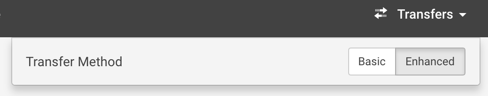

# Rescale File Upload Testing

We want you to write a couple of automated tests for uploading a file to the
Rescale platform and also provide some answers to some additional discussion
topics.

## Deliverables

### Automated UI Test
1. Register for a free account on https://platform.rescale.com/
1. There is an `Upload from this computer` button on the Files page
(https://platform.rescale.com/files/) that allows the user to upload a new file
to the platform. Write an automated UI test using whatever framework you want
to verify that a new file can be uploaded successfully.

### Automated API Test
1. By default, trial users do not have the ability to provision an API key.
After you have signed up, send an email to ryan@rescale.com and mention that
you are working on the QA Engineer homework problem and need to have an API key
created for you. After the key has been provisioned, you can view it from here:
https://platform.rescale.com/user/settings/api-key/
1. Write an automated API test in whatever framework you want to verify that
you can successfully upload a file through the API. Please review the
[API documentation](https://engineering.rescale.com/api-docs/) for more
information on how to do this.

### Discussion Topics
* The automated API and UI tests only cover the "happy path". Please describe
in detail what other types of automated tests you would set up to verify that
the file upload feature is working as expected.
* In the top nav, the Transfers menu item contains a toggle button for `Basic`
and `Enhanced`.
    
    * What is the difference between these two options? (Hint: look at the
    browser debug toolbar)
    * How do these different methods compare to uploading a file through the
    API?
    * What security or additional testing concerns do you have with these
    two approaches?

## Guidelines
* Please do not perform any stress or load testing against our production
platform.
